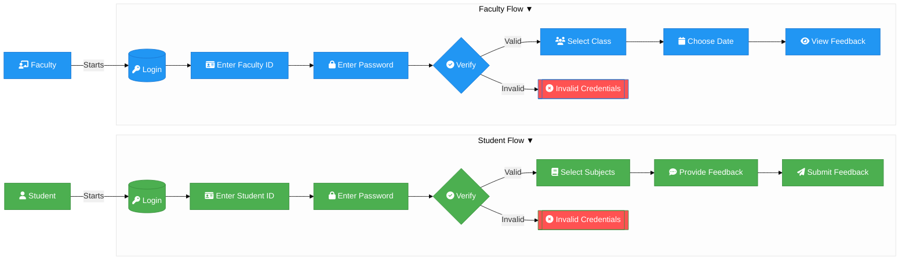
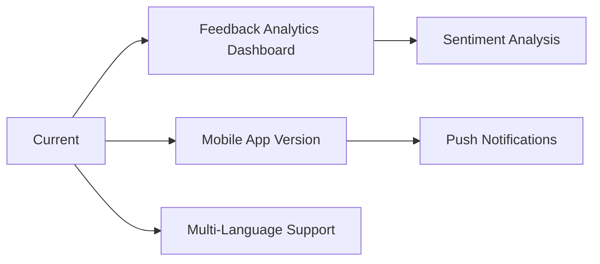

# 📚 Day to Day Student Feedback System  
*Anonymous Student-Teacher Feedback Platform*  

<div align="center">
  
  <br>
  
  [](LICENSE)
  [](https://python.org)
  [](https://sqlite.org)
</div>

---

## 🌟 **About The Project** 
A secure, anonymous platform designed to bridge classroom communication between students and teachers. Students provide **daily feedback** on teaching quality without revealing identities, while faculty access **real-time, serialized feedback** for their subjects/classes to improve instructional methods.

Day to Day Student Feedback System revolutionizes classroom communication with:  
🔒 **Anonymous daily feedback** from students → 📊 **Real-time insights** for teachers

---


## 🚀 **Key Features**  
| Role | Features | 
|------|----------| 
| **Students** | • Subject-specific feedback submission <br> • Anonymous reporting <br> • Simple GUI interface |  
| **Faculty** | • Class-wise feedback viewing <br> • Subject filtering <br> • Anonymous results display |
| **System** | • Secure login system <br> • SQLite database <br> • Tkinter GUI |

---

## 🛠 **Tech Stack**

### 💻 **Frontend**
| Technology       | Description                                       |
|------------------|---------------------------------------------------|
| **Python Tkinter** | GUI toolkit for building the desktop application. |
| **PIL (Pillow)**   | Image processing library for handling images.     |
| **ttkthemes**      | Styling for a polished UI experience.              |

### 🔧 **Backend**
| Technology         | Description                                       |
|--------------------|---------------------------------------------------|
| **SQLite3**         | Lightweight database for simple data storage.     |
| **MySQL Connector** | Interface to connect to MySQL databases.          |

### 🗄️ **Database**
| Table Name        | Purpose                                          |
|-------------------|--------------------------------------------------|
| **faculty**       | Stores faculty data.                            |
| **students**      | Stores student data.                            |
| **feedback**      | Stores feedback submitted by students.          |
| **student_subjects** | Tracks subjects registered by each student.   |


## 📊 Feedback System Interaction Flow

This flowchart represents the complete feedback system process for **Students** and **Faculty**, covering login, verification, and feedback actions.




## 📦 Installation

Follow the steps below to set up and run the application:

### 🔁 Clone Repository

```bash
git clone https://github.com/yourusername/Day-Day-to-Student-Feedback-System.git
cd Day-to-Day-Student-Feedback-System
```

### 🗃️ Initialize Database
```bash
python sq.py  # Creates database with sample data
```

### 📥 Install Dependencies
```bash
pip install -r requirements.txt
```

### 🚀 Install Dependencies
```bash
python main.py
```

## 🗄 Database Schema

### 📋 Faculty Table
```sql
CREATE TABLE faculty (
    faculty_id VARCHAR(10) PRIMARY KEY,
    password TEXT
);
```

### 📝 Feedback Table

```sql
CREATE TABLE feedback (
    id INTEGER PRIMARY KEY,
    subject TEXT,
    feedback TEXT
);
```

## 🔮 Future Roadmap

### 🚀 Upcoming Features
- 📊 Feedback Analytics Dashboard
  - 🧠 Sentiment Analysis
- 📱 Mobile App Version
  - 🔔 Push Notifications
- 🌐 Multi-Language Support

### 🧭 Flow Diagram


## 📄 License

Distributed under the **MIT License**.  
See the [LICENSE](LICENSE) file for more details.

## 🤝 Meet Our Awesome Team

> _"Alone we can do so little, together we can do so much."_ – **Helen Keller**

| 👤 Name                             | 🎓 Role             | 
|-----------------------------------|---------------------|
| 💡 **Dutta Krishna Madhumita**    | Team Lead           |
| 🔍 **Annadevara Sai Ratna Varshita** | Backend Developer   |
| 🛠 **Chinamanagonda Ranga Harika** | Frontend Developer  |
| 📊 **Ginjala Nooka Ratnam**        | Data Analyst        |
| 🌐 **Guttikonda Niharika**         | Integration Expert  |

---

## 📬 Contact Us

We're happy to connect and collaborate!

For any queries, suggestions, or feedback, feel free to reach out to our team:

- 📧 **Krishna Madhumita Dutta** – [krishnamadhumitadutta@gmail.com](mailto:krishnamadhumitadutta@gmail.com)

---

> 🙌 Thank you for checking out — where your voice matters!


